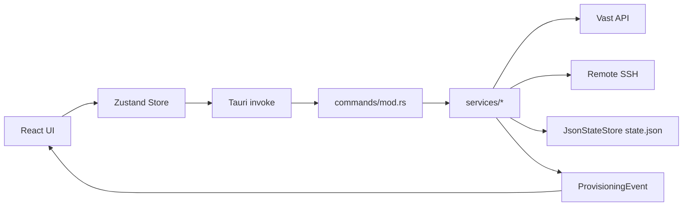
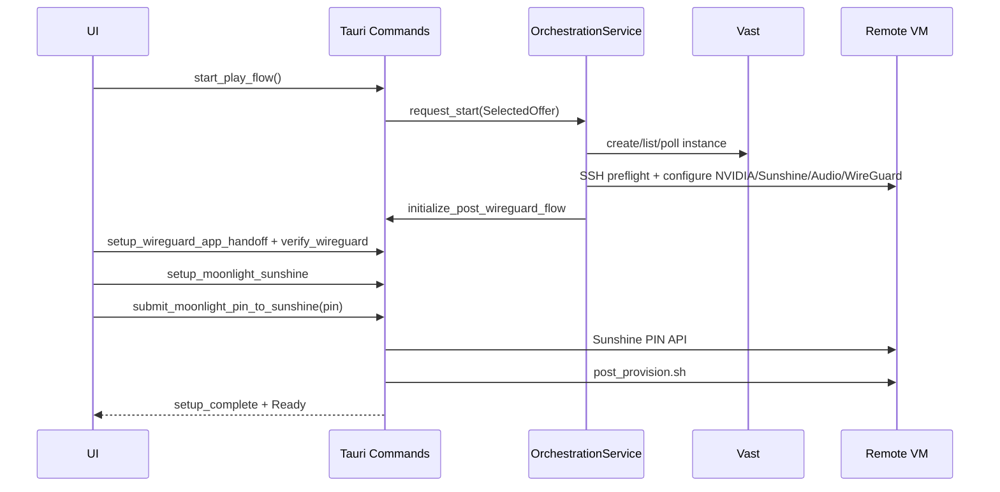

# Noland Connect: System Documentation

## 1. Overview

### What this system does

Noland Connect is a desktop orchestration client (Tauri + React + Rust) that provisions cloud GPU instances on Vast.ai, configures game streaming infrastructure (Sunshine + WireGuard), patches local Moonlight settings, and guides end users through secure pairing and post-provision setup.

### Why it exists

Manual cloud gaming setup is brittle and repetitive. Users must coordinate:

- cloud instance lifecycle
- SSH access
- NVIDIA headless/display setup
- Sunshine installation/configuration
- WireGuard tunnel provisioning
- Moonlight pairing and local configuration

Noland Connect automates these steps, preserves checkpoints, and exposes recoverable workflows.

### User/business problem solved

- Reduce time-to-stream from hours to minutes.
- Make setup repeatable across sessions and instance restarts.
- Provide recoverable, stateful provisioning for non-expert users.

### High-level architecture (plain English)

- **Frontend (React/Zustand)** calls typed backend commands via Tauri IPC.
- **Backend (Rust services)** performs orchestration and remote SSH actions.
- **Persisted state (`state.json`)** is the source of truth for setup progress and settings.
- **Event stream (`orchestration:progress`)** drives live status updates in UI.

---

## 2. Core Concepts

### Key entities

- **PersistedAppState**: complete local system state (credentials, instance data, setup stages, preferences).
- **ProvisionedServerState**: per-instance record with step checkpoints and runtime artifacts.
- **PostWireGuardSetupState**: post-WireGuard guided setup state machine.
- **ProvisioningEvent**: runtime progress/error event emitted to UI.

### Core services

- **OrchestrationService**: end-to-end provisioning coordinator.
- **WireGuardService**: remote tunnel provisioning and local tunnel monitor/normalization.
- **SunshineService**: Sunshine install/config/health checks and credential bootstrap.
- **MoonlightService**: local Moonlight detect/launch/config patching.
- **SleepInhibitService**: local machine sleep prevention during active sessions.
- **PostProvisionService**: executes packaged post-provision shell script.
- **InstanceLifecycleService**: reboot/pause/destroy/settings actions for existing instances.
- **RebootHelperService**: reboot and post-reboot recovery pipeline.
- **MicPassthroughService**: cloud microphone session setup/runtime status.

### Main state machines

1. **OrchestrationState**
   - provisioning macro-state (`CreatingInstance`, `ConfiguringSunshine`, `Ready`, etc.)
2. **SetupStage** (post-WireGuard)
   - guided pairing and tunnel handoff lifecycle

### Assumptions

- Remote compute target is Linux VM runtime.
- Local client can be macOS/Windows/Linux.
- Vast API key is provided by user and stored locally.

### Invariants

- `state.json` is always loaded and normalized on startup.
- provisioning events are append-only in memory (capped history).
- per-instance step markers are monotonic (set to complete when done).

---

## 3. Architecture

### Components

#### Frontend

- `src/app/App.tsx`: app shell and route wiring
- `src/store/appStore.ts`: state/actions/event handling
- `src/lib/backend.ts`: typed wrappers for Tauri commands
- Feature modules: onboarding, dashboard, provisioning, servers, settings, shared storage manager, and restore

#### Backend

- `src-tauri/src/main.rs`: startup, state load, command registration, background jobs
- `src-tauri/src/commands/mod.rs`: Tauri command layer
- `src-tauri/src/services/*`: domain orchestration and integration services

#### Persistence

- Local JSON file via `JsonStateStore` (no SQL database)
- Path: app data directory + `state.json`

#### Third-party integrations

- Vast.ai HTTP API
- SSH tools and remote Linux utilities
- Sunshine web/config API over tunnel
- Moonlight local client

### Boundaries between modules

- `commands/mod.rs`: IPC boundary and validation envelope.
- `services/*`: business logic and infrastructure commands.
- `models/*`: serialization contracts.
- `store/appStore.ts`: frontend orchestration and UX state.

### Request/data flow



---

## 4. Data Model

> This system does not use relational DB tables. Data model is persisted JSON + in-memory runtime maps.

### 4.1 PersistedAppState (source of truth)

Source: `src-tauri/src/models/app_state.rs`

Key ownership:

- **Backend owns writes** (via `AppContext::update_state`)
- Frontend reads snapshots via `get_app_state`

Important sections:

| Section | Purpose | Lifecycle |
|---|---|---|
| `credentials` | App username/password + Vast API key | Set on onboarding, mutable in settings |
| `ssh` | key names/paths and ssh auth settings | created during onboarding, reused |
| `instance` | currently active instance | set during provisioning or existing-instance selection |
| `wireguard` | active tunnel metadata and config path | set after WG provisioning/verification |
| `provisionedServers[]` | per-instance history + checkpoints | append/update per instance |
| `postWireguardSetup` | guided setup state | initialized when WG config generated |
| `moonlightPreferences` | local client tuning | user configurable |
| `sharedStorage` | backup/sync settings and status | user configurable + runtime status |

### 4.2 Per-instance checkpoint model

`ProvisionedServerSteps` controls resumability:

- `ssh_key_ready`
- `instance_created`
- `ssh_connected`
- `nvidia_headless_configured`
- `sunshine_configured`
- `wireguard_configured`
- `moonlight_configured`
- `pairing_completed`
- `post_provision_completed`

These flags are used to skip already-complete steps safely.

### 4.3 Post-WireGuard setup schema

`PostWireGuardSetupState` tracks:

- current stage (`SetupStage`)
- platform mode (`WireGuardSetupMode`)
- verification status (`WireGuardSetupStatus`)
- exported config path and host metadata
- pairing completeness and retryable errors

### 4.4 Event schema

`ProvisioningEvent`:

```json
{
  "state": "ConfiguringSunshine",
  "message": "Installing and configuring Sunshine",
  "details": "Display: 1920x1080 @ 120Hz",
  "timestamp": "2026-05-25T10:00:00Z",
  "isError": false
}
```

### 4.5 Runtime-only state

- `pairing_pin_in_memory` (AppContext): latest successful pairing PIN
- `MIC_SESSIONS` map (MicPassthroughService): active mic sessions per instance
- restore job maps (shared storage restore flow)

---

## 5. API / Interface Documentation

> Commands are local desktop IPC interfaces, not externally hosted HTTP endpoints.

### Auth model

- No external token auth on IPC commands (local desktop process boundary).
- Command behavior depends on persisted credentials:
  - Vast API key for Vast operations
  - Sunshine credentials for Sunshine API operations

### 5.1 Onboarding and state

#### `complete_onboarding(payload)`

- **Purpose**: initialize credentials + SSH key setup
- **Input**: `OnboardingPayload { appUsername, appPassword, vastApiKey }`
- **Output**: full `PersistedAppState`
- **Validation**: non-empty required fields
- **Errors**:
  - invalid input
  - ssh key generation/upload failures
  - Vast auth failure (`auth_failed`)

### 5.2 Orchestration lifecycle

#### `start_play_flow()` / `start_play_existing_instance(instanceId)`

- **Purpose**: start full provisioning or existing-instance resume flow
- **Output**: async job, progress via events
- **Errors**:
  - missing onboarding/offer context
  - reservation/SSH/provisioning failure

### 5.3 Post-WireGuard guided setup

#### `setup_wireguard_app_handoff_command()`

- **Purpose**: export config + open WireGuard app
- **Output**: `PostWireGuardSetupState`

#### `verify_wireguard()`

- **Purpose**: reachability probe to tunnel host/ports
- **Output**: `ReachabilityResult`

#### `setup_moonlight_sunshine_command()`

- **Purpose**: verify Sunshine, detect Moonlight, launch pairing prep
- **Output**: `PostWireGuardSetupState`

#### `submit_moonlight_pin_to_sunshine_command(pin)`

- **Purpose**: submit PIN to Sunshine API and finalize setup
- **Validation**: 4+ digit numeric pin
- **Output**: `PostWireGuardSetupState`
- **Failure behavior**: retryable stage errors maintained in `lastError`

### 5.4 Instance lifecycle

#### `reboot_instance_services(instanceId)`

- **Purpose**: reboot remote instance and run service recovery checks
- **Output**: status message

#### `pause_instance(instanceId)` / `destroy_instance(instanceId)`

- **Purpose**: mutate remote lifecycle state in Vast

### 5.5 Shared storage + restore

- `get_shared_storage_settings`, `save_shared_storage_settings`
- backup trigger commands
- bundle index/restore commands (`generate_bundle_index`, `dry_run_restore`, `restore_bundle`, `get_restore_job`)

### 5.6 Mic passthrough

- `enable_instance_mic(instanceId, qualityProfile?)`
- `disable_instance_mic(instanceId)`
- `reconnect_instance_mic(instanceId)`
- status/config query commands

### Error interface

All command failures are normalized into `FrontendError`:

```json
{
  "code": "provisioning_failed",
  "message": "Provisioning failed. Check diagnostics and retry.",
  "details": "...",
  "retryable": true
}
```

---

## 6. Execution Flow

### 6.1 Happy path (selected offer -> ready)



### 6.2 Failure paths

- Vast auth or API mismatch -> `auth_failed` / `api` errors
- SSH connectivity timeout -> retry and timeout error
- Sunshine PIN submit non-success -> retryable setup error state
- post-provision failure -> currently non-fatal warning in completion path

### 6.3 Async behavior and retries

- Provisioning work runs async and emits events.
- Instance readiness polling retries up to configured max attempts.
- Some services include best-effort fallback paths and non-fatal warnings.

### 6.4 Idempotency and ordering

- Checkpoint markers enable idempotent reruns.
- Ordering guarantees are local to service flow; race prevention uses context guards (e.g., orchestration mutex and cancellation flag).

### 6.5 Race-condition concerns

- Concurrent starts are serialized by orchestration guard.
- WireGuard mutation has a dedicated in-progress guard.
- UI state can drift if events arrive before refresh; store actions mitigate via explicit refresh calls.

---

## 7. State Management

### Ownership model

- **Persisted backend state**: authoritative (`PersistedAppState`)
- **Frontend store state**: derived/cache + UI control state
- **Runtime maps**: ephemeral operational state (mic sessions, cached events)

### Rehydration

- At startup: load `state.json`, merge with defaults, normalize fields, persist migrated result.

### Refresh/invalidation

- Frontend invokes `get_app_state` / `get_setup_status` after mutating operations.
- Provisioning events provide incremental status but do not replace full-state refresh.

### Optimistic updates / rollback

- Minimal optimistic behavior on frontend; most actions await backend result.
- Failures return `FrontendError` and retain retryable stage state where applicable.

---

## 8. Security & Permissions

### Authentication/authorization

- Vast API uses bearer key from persisted credentials.
- Sunshine API uses basic auth over tunnel endpoint.
- No multi-user RBAC layer; app is single-user desktop operator model.

### Sensitive data handling

- Credentials are persisted in local JSON by design (phase requirement).
- Logging includes redaction utility for sensitive values in selected paths.

### Validation boundaries

- Input validation at command layer and service layer:
  - PIN format
  - onboarding payload required fields
  - username sanitization for post-provision execution

### Risks

- Local plaintext secrets in `state.json`.
- Shell command orchestration over SSH increases injection risk if sanitization is incomplete.
- Long-running sudo/system operations on remote VM require strict command hygiene.

---

## 9. Error Handling & Observability

### Error taxonomy

- `AppError` variants: `Api`, `Authentication`, `InvalidInput`, `Provisioning`, `Timeout`, etc.
- Mapped to frontend-safe `FrontendError` with code/message/retryable hints.

### Logging

- Rust `tracing` logs across commands/services.
- Vast API requests include endpoint/method/timing logs.
- Provisioning events stored in in-memory ring buffer (max 500).

### Debug signals

- `orchestration:progress` event stream
- per-step transition messages
- command stderr/stdout diagnostics in many recovery paths

### Typical diagnosis procedure

1. Inspect UI provisioning timeline.
2. Pull `get_provisioning_logs` output.
3. Identify failing orchestration/setup stage.
4. Correlate with service logs and remote command diagnostics.

---

## 10. Testing Strategy

### Current coverage posture

- Limited unit tests exist in selected backend services (`reboot_helper`, `post_wireguard_setup`, `mic_passthrough`, `bundle_restore`).
- No full contract/e2e suite is present in this repo snapshot.

### Recommended test layers

- **Unit**: parsers, state transition helpers, error mapping.
- **Integration**: command->service state updates with mocked state store and mocked SSH outputs.
- **E2E (staging)**: full provisioning against disposable Vast instances.
- **Workflow tests**: CI lint/validation for YAML and release artifact patterns.

### High-priority edge tests

- post-WireGuard PIN failure and retry behavior
- checkpoint resume from partial provisioning
- reboot recovery path with delayed service readiness
- shared storage restore dry-run vs apply consistency

---

## 11. Deployment & Operations

### Build/runtime dependencies

- Node 20 + npm
- Rust stable toolchain
- Tauri 2 build prerequisites per target OS

### Local commands

```bash
npm install
npm run dev
npm run tauri:dev
npm run tauri:build
```

### CI/CD workflows

- `.github/workflows/release.yml` (shared matrix)
- `.github/workflows/release-macos-intel.yml` (dedicated Intel macOS)

Triggers:

- pushes to `main`
- tag pushes `v*`
- manual dispatch

Release behavior:

- tag builds attach artifacts to version release
- main pushes update prerelease tag `main-latest`

### Rollback approach

- For app behavior regressions: revert to known-good commit and rerun workflow.
- For state issues: inspect/migrate `state.json` with defaults merge behavior.

---

## 12. Known Risks / Edge Cases

1. **State schema drift**
   - Frontend type mirrors can lag backend schema.
2. **Long shell command fragility**
   - Nested quoting and distro differences can break recovery scripts.
3. **Runner availability bottlenecks**
   - macOS Intel artifacts are currently produced by both the shared workflow and the dedicated Intel workflow, which can create duplicate-release complexity.
4. **Cloud variability**
   - Vast instance startup times and host configs vary widely.
5. **Manual WireGuard control divergence**
   - local tunnel state may differ from expected config by design.
6. **Credential persistence security tradeoff**
   - plaintext local storage is operationally convenient but high risk.

Mitigations:

- strict checkpointing and recoverable setup states
- explicit diagnostics and evented status
- workflow separation for problematic runners, though the current release setup still has overlapping Intel macOS coverage
- additive schema evolution via defaults

---

## 13. Future Improvements

1. Introduce robust schema migrations (versioned migration functions).
2. Add integration/E2E test harness for provisioning and post-WireGuard flows.
3. Move secrets to secure storage (keychain/credential vault).
4. Replace long inline shell scripts with templated script assets and stronger input escaping.
5. Add explicit structured metrics (step durations, fail rates by stage).
6. Add command-level idempotency keys for long-running operations.
7. Expand release validation and artifact integrity checks.

---

## Open Questions

1. Should post-provision failures remain non-fatal after successful pairing, or become blocking?
2. What are the target SLOs for "time to Ready" and reboot recovery?
3. Is encrypted local credential storage required in the next phase?
4. Should local WireGuard health monitor remain observational-only on all platforms permanently?
5. Is there a required production signing/notarization policy for release artifacts?
