# Shared Storage: High-Level Flow

This document explains, at a very high level, how Noland shared storage works and which tools/components are involved.

Shared storage lets a Vast GPU instance save and restore selected app/game state through a cloud-backed repository. The local Noland app controls the flow, but the heavy work happens on the rented Vast instance through the `state-agent`.

## Big Picture

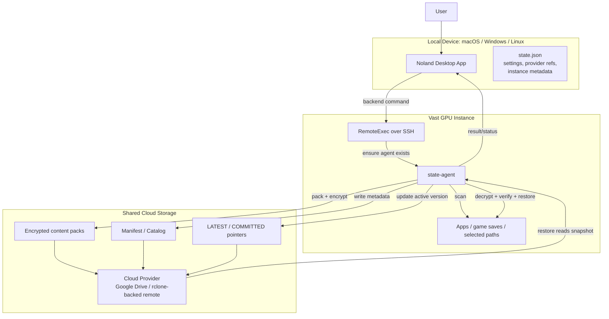

## Backup / Sync Flow

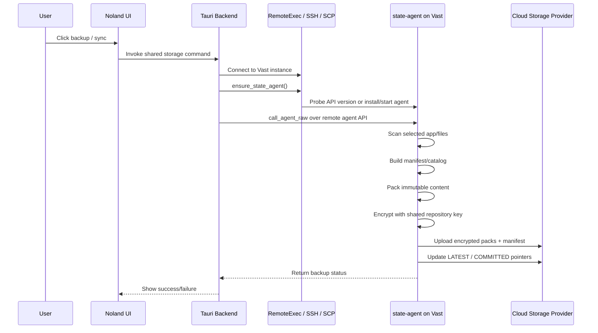

## Restore Flow

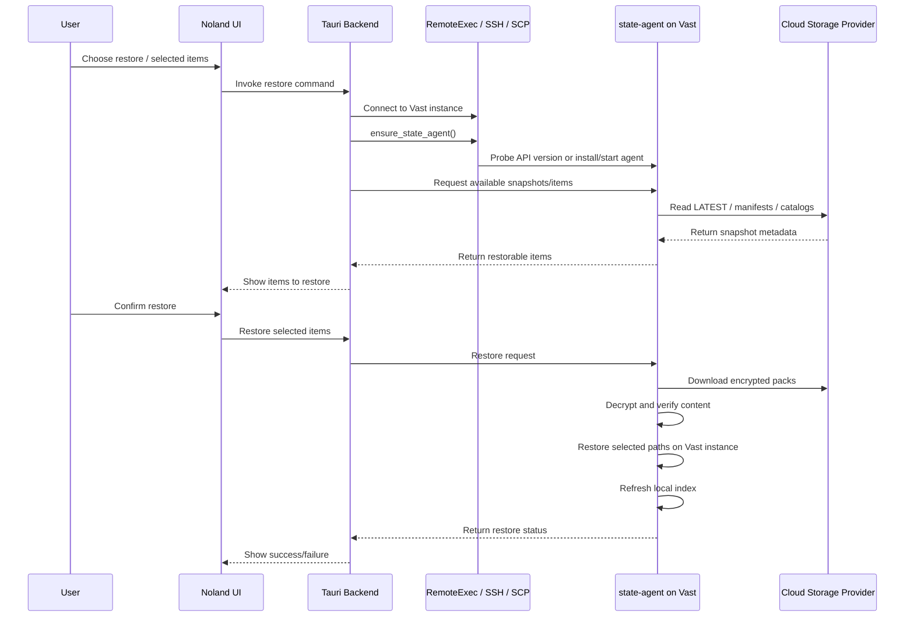

## Tools and Components Used

| Area | Tool / Component | What it does |
| --- | --- | --- |
| Local app | React UI | Lets the user choose backup, sync, restore, provider, and selected items. |
| Local app | Tauri backend commands | Receives UI requests and coordinates shared-storage operations. |
| Local state | `state.json` | Stores settings, provider references, instance metadata, and shared-storage configuration. It does **not** store the full app/game data. |
| Remote access | `RemoteExec` | Backend abstraction for running commands on the Vast instance. |
| Remote access | SSH | Connects from the local app/backend to the Vast instance. |
| Remote upload | SCP | Uploads the bundled `state-agent` source/archive when the agent needs to be installed or refreshed. |
| Agent setup | `ensure_state_agent()` | Checks whether the remote agent is available and compatible; if not, uploads/bootstrap-starts it. |
| Agent packaging | Rust `flate2` + `tar` | Packs bundled `state-agent` source into a `.tar.gz` without depending on platform shell `tar`. |
| Remote service | `systemd` / socket service | Runs the `state-agent` on the Vast instance so the backend can call it reliably. |
| Agent API | `call_agent_raw` | Sends raw requests from the Tauri backend to the remote `state-agent`. |
| State logic | `state-agent` | Scans files, indexes app state, creates manifests, packs content, encrypts data, uploads/downloads, and restores selected paths. |
| Storage adapter | `rclone` | Talks to the selected cloud provider using static or OAuth-backed profiles. |
| Cloud provider | Google Drive / other rclone-backed remotes | Stores encrypted packs, manifests, catalogs, and latest snapshot pointers. |
| Repository data | Manifest / catalog | Describes what files/items exist in a snapshot and how to restore them. |
| Repository data | CAS/content packs | Immutable packed file content, encrypted before upload. |
| Repository data | `LATEST` / `COMMITTED` | Pointers that mark the newest safe shared-storage state. |
| Security | App-wide repository key | Encrypts/decrypts shared-storage content. This key is app-wide and should not be deleted when a provider is disconnected. |

## What Lives Where

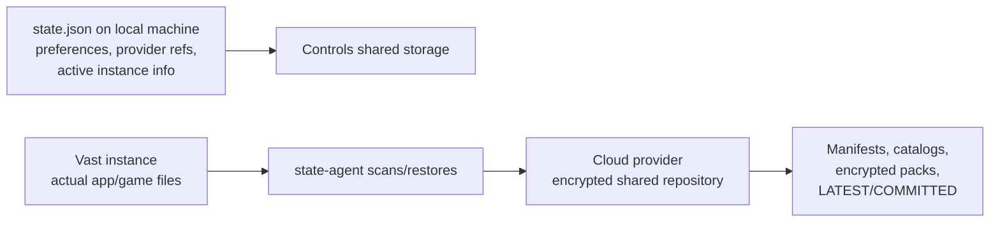

### Local machine

- Runs the Noland desktop app.
- Stores `state.json` with configuration and references.
- Initiates backup/sync/restore commands.
- Does not store the full shared app/game data unless that data also exists locally for another reason.

### Vast instance

- Contains the live app/game files being backed up or restored.
- Runs `state-agent`.
- Performs scanning, packing, encryption, download, verification, and restore.

### Cloud provider

- Stores the shared repository.
- Stores encrypted data only.
- Can be backed by Google Drive or another `rclone`-supported provider/profile.

## Key Design Rules

1. **The local app orchestrates; the remote agent does the file work.**
2. **Cloud storage stores encrypted snapshots, not plain app files.**
3. **`state.json` stores references/settings, not the full shared-storage payload.**
4. **The repository encryption key is app-wide and must survive provider disconnects.**
5. **Restore is manifest-driven:** the agent reads snapshot metadata, downloads required packs, verifies them, then restores selected paths.
6. **The state-agent is bootstrapped automatically:** if the Vast instance does not have a compatible agent running, the backend uploads and starts one.

## Simplified Mental Model

```text
Noland App
  -> connects to Vast instance
  -> makes sure state-agent is running
  -> asks state-agent to backup or restore

state-agent
  -> scans app/game files
  -> creates encrypted snapshots
  -> uses rclone to upload/download from cloud storage

cloud storage
  -> stores encrypted packs and manifests
  -> lets a future Vast instance restore the same state
```

---

# Deeper Technical View

The shared-storage system has more complexity than a normal upload/download flow because it crosses several trust and runtime boundaries:

1. Local desktop app runtime.
2. Local persisted app state.
3. SSH/SCP transport into a rented machine.
4. A remote service that may or may not already be installed.
5. Cloud provider configuration and auth.
6. Encrypted, content-addressed repository data.
7. Restore semantics for live app/game folders.

## Technical Architecture

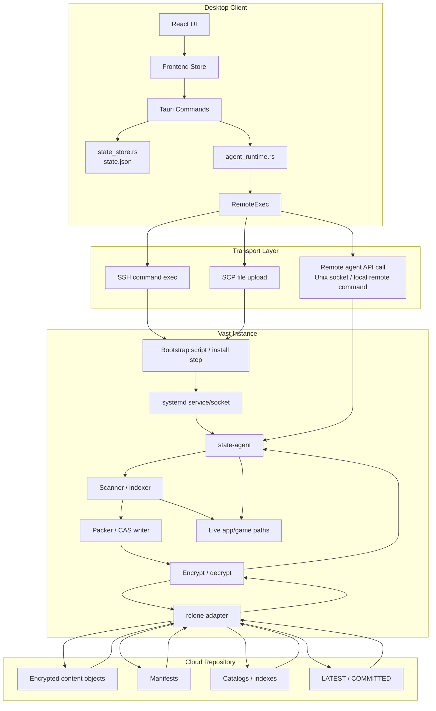

## Bootstrap Complexity: `ensure_state_agent()`

Before any shared-storage operation can run, the backend needs a working `state-agent` on the Vast instance. The instance is rented/ephemeral, so the app cannot assume the service is already there.

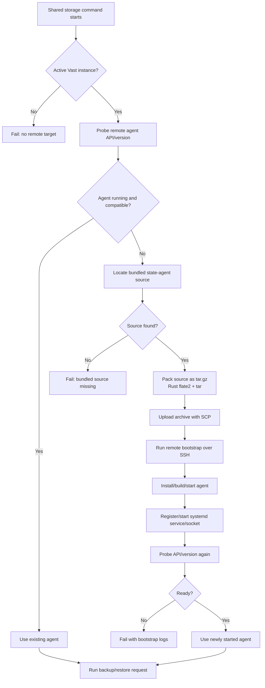

### Why this is complex

- The Vast instance may be fresh, partially configured, rebooted, or replaced.
- The remote user, paths, package manager state, and service state may vary.
- The desktop app must work on macOS, Windows, and Linux, so it cannot rely on local shell tools like `tar`.
- The app must locate the bundled `state-agent` source from different Tauri resource layouts.
- The backend needs a version/API probe so old remote agents are not used accidentally.

## Backup Internals

A backup/sync is not just “upload this folder”. It is closer to building a small encrypted repository snapshot.

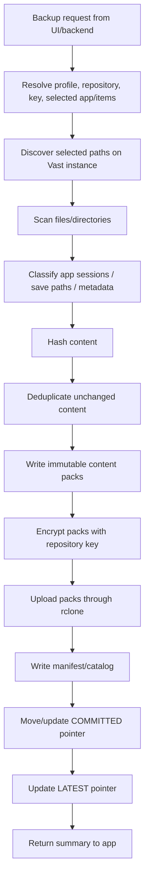

### Important details

- **Scanning:** the agent walks selected paths and records file metadata.
- **Classification:** paths may represent different apps, launchers, save folders, or session data.
- **Hashing/CAS:** content can be addressed by hash so unchanged files do not need to be duplicated.
- **Packing:** many files can be packed into fewer repository objects for efficiency.
- **Encryption:** data is encrypted before it is stored in the cloud provider.
- **Manifest/catalog:** metadata describes what exists in the snapshot and how to restore it.
- **Pointers:** `COMMITTED`/`LATEST` are updated last so an incomplete upload does not become the active snapshot.

## Restore Internals

Restore needs to be careful because it writes back into live folders on the Vast instance.

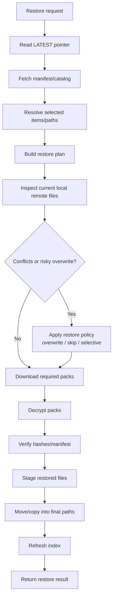

### Restore risks the system must handle

- The current Vast instance may already have local changes.
- Some files may be locked or actively used by the app/game.
- A restore may be partial if the user selected only certain items.
- Downloaded content must be verified before replacing files.
- The system should avoid making a partially downloaded or corrupted snapshot look successful.

## Repository Layout Concept

The exact object names can evolve, but conceptually the cloud repository looks like this:

```text
shared-storage-repository/
  LATEST                    # points to newest visible snapshot
  COMMITTED                 # points to newest fully committed write

  manifests/
    snapshot-a.json.enc     # encrypted snapshot metadata
    snapshot-b.json.enc

  catalogs/
    catalog-a.json.enc      # encrypted searchable/index metadata
    catalog-b.json.enc

  packs/
    ab/
      abcd1234....pack.enc  # encrypted immutable content pack
    ef/
      ef987654....pack.enc

  profiles-or-metadata/
    provider-safe metadata  # non-secret or encrypted metadata only
```

## Consistency Model

Shared storage should behave like an eventually consistent encrypted snapshot repository.

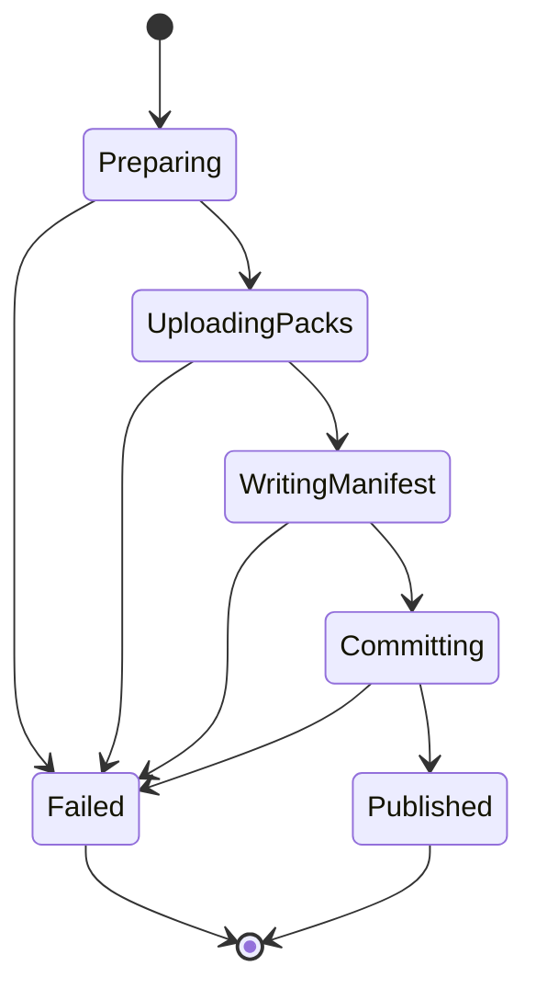

### Commit ordering

To avoid exposing broken snapshots:

1. Upload content packs first.
2. Upload manifest/catalog after the packs exist.
3. Update `COMMITTED` after all required data is present.
4. Update `LATEST` only when the snapshot is safe to show/restore.

If the process fails before `LATEST` is updated, the previous snapshot remains the visible restore target.

## Security Boundaries

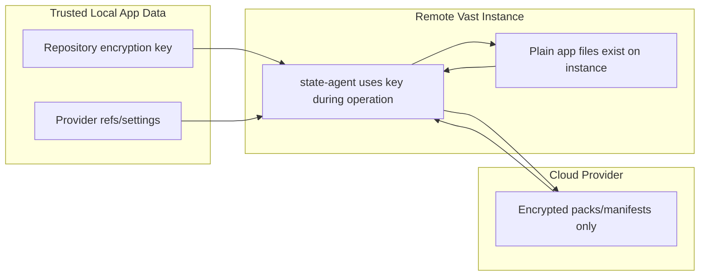

### Security rules

- The cloud provider should only receive encrypted repository objects.
- The repository encryption key is app-wide and must survive provider disconnect/reconnect.
- Disconnecting Google Drive or another provider should remove provider linkage, not destroy the key needed to read existing backups.
- Secrets should not be written into diagnostic logs or GitHub issue bodies.
- Provider OAuth/static profiles should be treated separately from repository encryption.

## Failure Modes and What They Mean

| Failure | Likely layer | Meaning |
| --- | --- | --- |
| Cannot SSH to instance | Transport | Vast instance is not reachable, not ready, or credentials/network path are wrong. |
| SCP upload fails | Transport/bootstrap | The backend cannot upload the `state-agent` bundle. |
| Bundled agent source missing | Local packaging | Tauri resource layout or bundled resources are wrong. |
| Agent version probe fails | Remote service | Agent is not running, socket is missing, or API is incompatible. |
| `rclone` config/auth fails | Provider adapter | Cloud provider profile is missing, expired, or invalid. |
| Upload fails before `LATEST` | Repository write | New snapshot should not become visible; previous snapshot remains active. |
| Manifest exists but packs missing | Repository integrity | Snapshot is incomplete/corrupt and should fail verification. |
| Decryption fails | Security/key | Wrong repository key, corrupted object, or incompatible encryption format. |
| Restore verification fails | Integrity | Downloaded content does not match manifest/hash. |
| Restore apply fails | Remote filesystem | Permission issue, missing path, locked file, or disk problem on Vast instance. |

## Why `state.json` Is Not the Shared Storage Repository

`state.json` is local app state. It should contain things like:

- selected provider/profile references;
- active/recent Vast instance IDs;
- shared-storage settings;
- orchestration state;
- UI-visible status and preferences.

It should **not** contain the full app/game backup payload.

The actual backup payload is stored remotely as encrypted repository objects:

```text
state.json = local control plane state
cloud repository = encrypted shared data plane
Vast instance = live filesystem being backed up/restored
```

## End-to-End Technical Flow

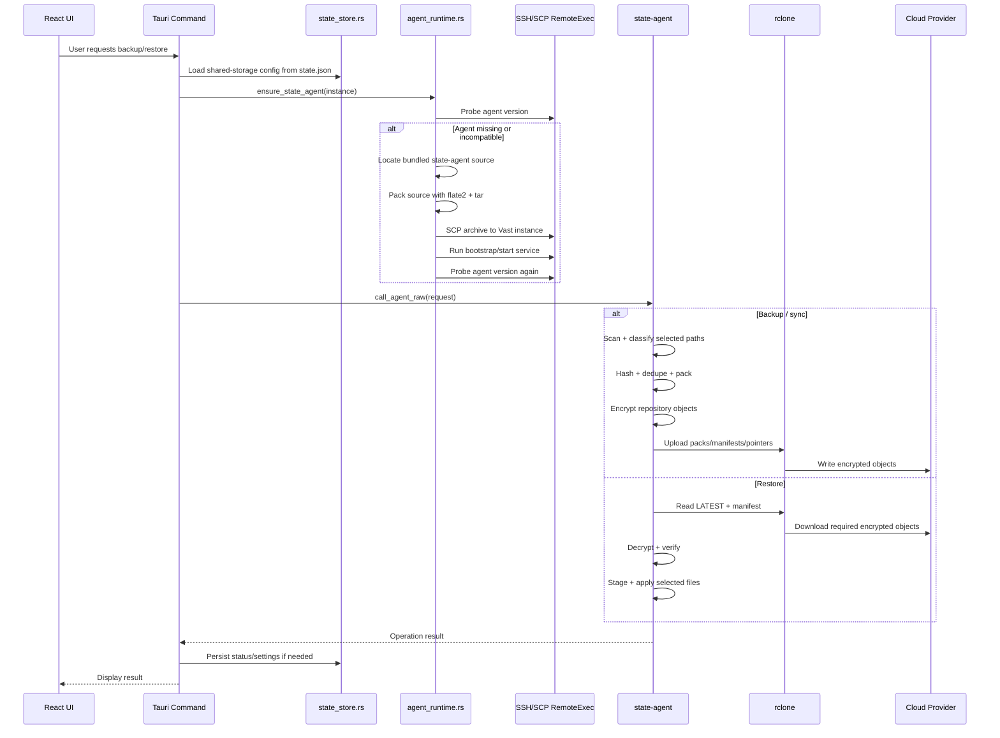

## Practical Debugging Map

When shared storage breaks, debug by layer:

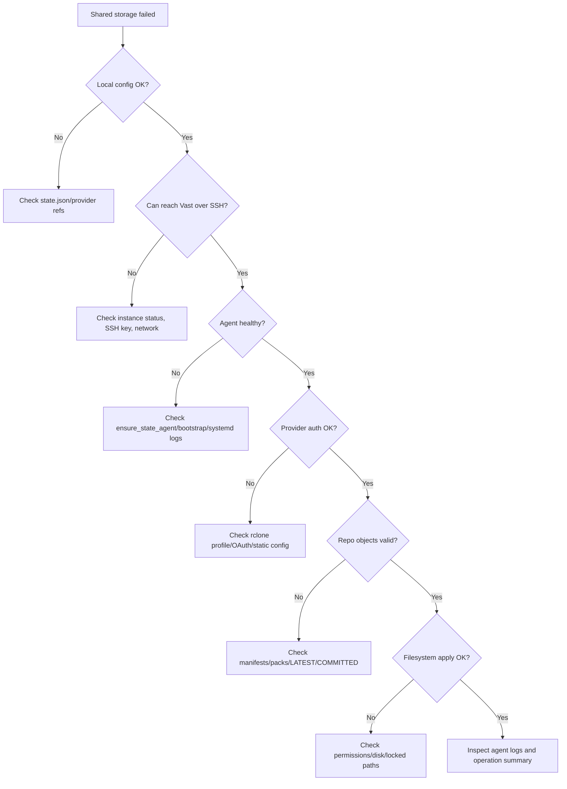

## Main Complexity Summary

The hard parts are not the cloud upload itself. The hard parts are:

- bootstrapping a compatible agent onto an ephemeral rented machine;
- keeping the local app cross-platform while controlling a Linux remote host;
- making writes commit-safe so broken snapshots are not published;
- encrypting data independently from the cloud provider;
- preserving the repository key across provider disconnects;
- restoring only selected files without damaging live remote state;
- reporting enough diagnostics for users to understand which layer failed.
